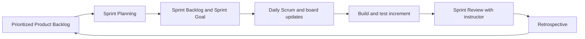
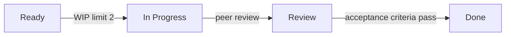
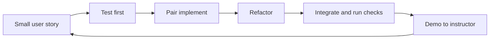
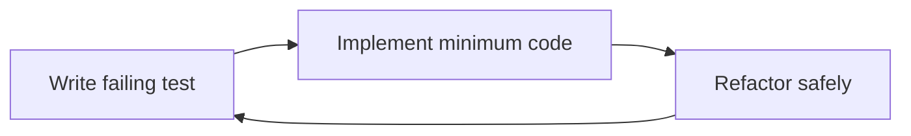
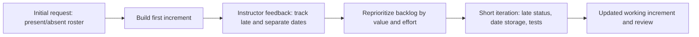

# Agile workflow diagrams

## Q1 — Scrum sprint flow

```mermaid
flowchart LR
  PB[Prioritized Product Backlog] --> SP[Sprint Planning]
  SP --> SB[Sprint Backlog and Sprint Goal]
  SB --> D[Daily Scrum and board updates]
  D --> DEV[Build and test increment]
  DEV --> SR[Sprint Review with instructor]
  SR --> RET[Retrospective]
  RET --> PB
```

## Q2 — Kanban

```mermaid
flowchart LR
  B[Ready] -->|WIP limit 2| P[In Progress]
  P -->|peer review| R[Review]
  R -->|acceptance criteria pass| D[Done]
```

## Q2 — XP feedback loop

```mermaid
flowchart LR
  S[Small user story] --> T[Test first]
  T --> PAIR[Pair implement]
  PAIR --> RF[Refactor]
  RF --> CI[Integrate and run checks]
  CI --> DEMO[Demo to instructor]
  DEMO --> S
```

## Q2 — TDD cycle

```mermaid
flowchart LR
  RED[Write failing test] --> GREEN[Implement minimum code]
  GREEN --> REFACTOR[Refactor safely]
  REFACTOR --> RED
```

## Q3 — evolving requirement

```mermaid
flowchart LR
  I[Initial request: present/absent roster] --> M[Build first increment]
  M --> F[Instructor feedback: track late and separate dates]
  F --> P[Reprioritize backlog by value and effort]
  P --> N[Short iteration: late status, date storage, tests]
  N --> U[Updated working increment and review]
```
